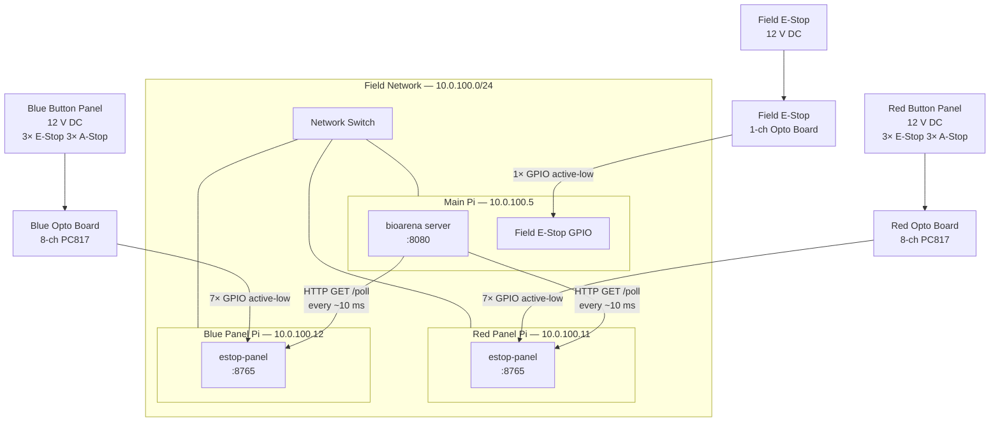
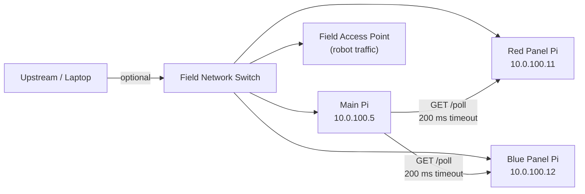
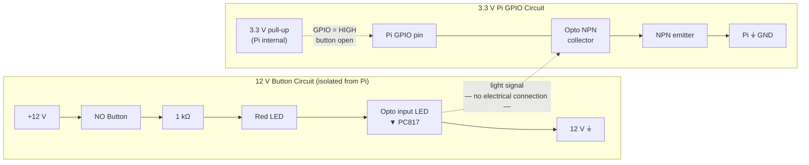
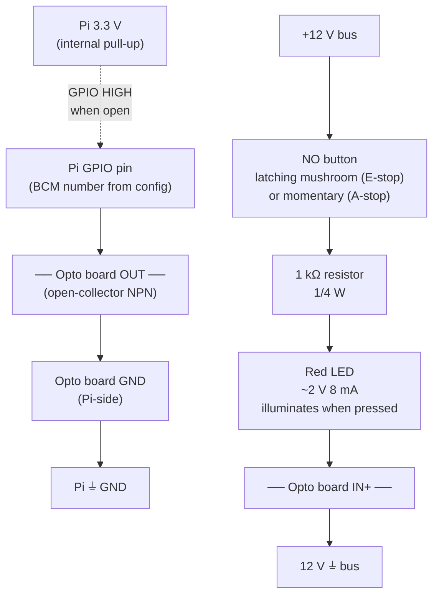
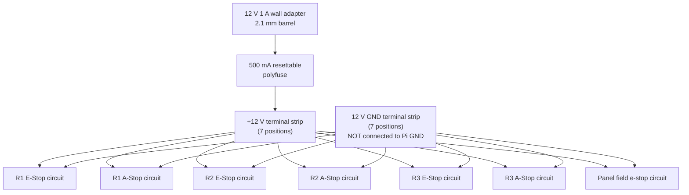

# Hardware Wiring Guide

This guide walks a first-time builder through wiring all field hardware: the main Pi, one panel Pi per alliance, the opto-isolation boards, and the button panels.
Buttons run on 12 V DC so that indicator LEDs are bright and no high voltage reaches the Raspberry Pi GPIO pins.

---

## Contents

1. [System Overview](#1-system-overview)
2. [Bill of Materials](#2-bill-of-materials)
3. [Network Topology](#3-network-topology)
4. [How Opto-Isolation Works](#4-how-opto-isolation-works)
5. [Single Button Circuit](#5-single-button-circuit)
6. [Wiring an E-Stop Panel Pi](#6-wiring-an-e-stop-panel-pi)
7. [Main Pi Field E-Stop](#7-main-pi-field-e-stop)
8. [Power Distribution](#8-power-distribution)
9. [Physical Panel Layout](#9-physical-panel-layout)
10. [Software Configuration](#10-software-configuration)
11. [Test Procedure](#11-test-procedure)
12. [Troubleshooting](#12-troubleshooting)

---

## 1. System Overview

Three Raspberry Pis connect through a network switch. The two panel Pis each handle one alliance's buttons; the main Pi polls them over HTTP and runs the arena server.



---

## 2. Bill of Materials

One set of this list covers both alliances plus the main Pi field e-stop.
Quantities marked with **×2** mean one per alliance.

| Qty | Item | Specification | Notes |
|-----|------|---------------|-------|
| 3 | Raspberry Pi 4B (or 3B+) | Any model with Ethernet | 1 main + 2 panel Pis |
| **×2** | 8-channel opto-isolation input board | PC817-based, 5–24 V input, open-collector NPN output, 3.3 V logic compatible | "8-CH Opto Coupler Isolation Board" on Amazon/AliExpress; ~$5–10 each. **Do not** buy relay output boards — you need input opto boards. |
| 1 | 1-channel opto-isolation input board | Same spec as above, single channel | For main Pi field e-stop |
| **×2** | 3× NO latching mushroom e-stop button | 22 mm, NO contact + separate lamp terminals, 12 V rated lamp | Red for red alliance, yellow for blue alliance recommended |
| **×2** | 3× NO momentary pushbutton (A-stop) | 16–22 mm, NO contact | Any colour; these are not latching |
| 1 | NO latching mushroom e-stop button | 22 mm, yellow or red | Field-wide e-stop |
| **×2** | 12 V 1 A regulated power adapter | 2.1 mm barrel connector, regulated DC | One per alliance panel |
| **×2** | 500 mA resettable polyfuse (PTC) | Rated ≥ 15 V | Protects each 12 V supply; inline on the +12 V feed |
| **×2** | DIN rail section, ~20 cm | 35 mm standard | Mounts inside enclosure |
| **×2** | Small enclosure, ~150×100×60 mm | IP54 or better | Holds Pi + opto board |
| **×1** | 2× terminal block strip | 10-position, 12 V / 5 A rated | +12 V bus and GND bus per panel |
| As needed | 22 AWG 2-conductor twisted pair | Rated ≥ 24 V | Button wiring; twisted pair reduces noise on long runs |
| As needed | Ferrule crimp terminals | 22 AWG | Clean screw-terminal connections; highly recommended |
| As needed | Wire labels / heat-shrink label sleeves | — | Label every wire at both ends |
| As needed | 1 kΩ resistors (1/4 W) | ±5% or better | One per button (7 per panel + 1 for field stop) |

> **Component note:** The 1 kΩ resistor limits current through the red indicator LED and the opto input LED to ~8 mA at 12 V. This value accounts for the LED forward voltages (red LED ~2 V, PC817 input LED ~1.2 V) with the remaining ~8.8 V across the resistor.

---

## 3. Network Topology

All three Pis sit on the same 10.0.100.0/24 subnet, connected through the field switch. No special VLANs are needed for the e-stop traffic; the main Pi polls each panel Pi over plain HTTP.



Static IPs are set by the systemd service files (see [Software Configuration](#10-software-configuration)).

---

## 4. How Opto-Isolation Works

An optocoupler (opto-isolator) transfers a signal using light across a gap between two electrically independent circuits. The input side (LED) and the output side (phototransistor) share no electrical path — only photons.



**What happens when the button is pressed:**

1. The NO (normally open) contact closes, completing the 12 V circuit.
2. Current flows through the 1 kΩ resistor, the red LED (lights up), and the opto input LED.
3. Light from the opto LED turns on the NPN transistor on the Pi side.
4. The transistor pulls the Pi GPIO pin to GND → **pin reads LOW (0)**.
5. The estop-panel server detects LOW and reports the e-stop to the main Pi.

**What happens when the button is not pressed (normal operation):**

- The NO contact is open; no current flows; red LED is off; opto transistor is off.
- The Pi internal pull-up holds the GPIO pin HIGH (1).
- The server reads HIGH and reports no active stop.

> **Important — do not connect the two GNDs.**
> The 12 V circuit GND and the Pi GND must remain separate at all times. Connecting them defeats the isolation and may damage the Pi.

> **Button type — NO, not NC.**
> Use **NO (normally open)** buttons: contacts open when released, close when pressed. The code logic (`LOW = pressed`) requires NO contacts with an internal pull-up.

---

## 5. Single Button Circuit

The same circuit is used for all 7 inputs per panel (6 station buttons + 1 field e-stop input on the panel itself) and for the main Pi field e-stop.



**Resistor and LED in the same branch as the opto input LED:**
The 1 kΩ resistor, the red LED, and the opto input LED are wired in series. When the button closes, all three see the same ~8 mA. The red LED glows as long as the button is latched/held. When the button is released (or reset), the LED extinguishes and the opto turns off, returning the GPIO to HIGH.

---

## 6. Wiring an E-Stop Panel Pi

Each panel Pi has 7 GPIO inputs. The table below uses the pin numbers from the example `estop-panel.yaml`. You may change any pin in the config as long as the BCM number matches the physical wire.

### GPIO pin reference

| Function | BCM pin | Physical header pin | Opto board channel |
|----------|---------|--------------------|--------------------|
| Station 1 E-Stop | 17 | 11 | CH1 |
| Station 1 A-Stop | 27 | 13 | CH2 |
| Station 2 E-Stop | 22 | 15 | CH3 |
| Station 2 A-Stop | 23 | 16 | CH4 |
| Station 3 E-Stop | 24 | 18 | CH5 |
| Station 3 A-Stop | 25 | 22 | CH6 |
| Field E-Stop (panel) | 5 | 29 | CH7 |
| Pi GND | — | 6 (or any GND pin) | Opto board GND (Pi side) |

> Use the BCM numbers in `estop-panel.yaml`, not physical pin numbers.

### Step-by-step wiring

**12 V (button side) — opto board input terminals:**

1. Run **+12 V** from the power bus to the first terminal of each button.
2. From the second terminal of the button, run through a 1 kΩ resistor and a red LED (in series) to the opto board **IN+** terminal for that channel.
3. Connect the opto board **IN−** terminals (or the common input GND rail) to the **12 V GND bus**. This GND must not touch any Pi GND wire.

**3.3 V (Pi side) — opto board output terminals:**

4. Connect each opto board **OUT** (collector) terminal to the corresponding Pi GPIO pin using the table above.
5. Connect the opto board's **Pi-side GND** terminal (often labelled GND or COM on the output side) to any Pi GND pin (physical pin 6, 9, 14, 20, 25, 30, 34, or 39).
6. Do **not** add external pull-up or pull-down resistors; the Pi's internal pull-up handles this.

> **Opto board supply voltage:** Many 8-channel boards require a logic supply on the output side (often 3.3 V or 5 V from the Pi). Check your board's datasheet. If required, connect this pin to Pi 3.3 V (physical pin 1 or 17) **only** — never to the 12 V supply.

---

## 7. Main Pi Field E-Stop

The main bioarena server can monitor a local GPIO pin for a field-wide e-stop. Wire it through a single-channel opto board using the same circuit as in section 5.

Configure the pin in **Setup → Settings → Field E-Stop Pin** in the web UI, or set `field_estop_pin` in the database. The `FieldEStopPanel` latches when the button is pressed and clears only when the button is physically released — it does not auto-clear between matches.

Recommended BCM pin: **BCM 6** (physical pin 31), leaving the panel Pi example pins free.

---

## 8. Power Distribution

Each panel Pi uses its own 12 V supply. The 12 V circuit and the Pi power (USB-C, 5 V) are separate supplies.



Run the Pi from a separate USB-C power supply (≥ 3 A for Pi 4). Do not power the Pi from the 12 V supply without a proper 5 V regulator.

---

## 9. Physical Panel Layout

A typical alliance button panel has three driver stations across a table edge. Suggested layout:

```
┌──────────────┬──────────────┬──────────────┐
│  Station 1   │  Station 2   │  Station 3   │
│              │              │              │
│  [E-STOP]    │  [E-STOP]    │  [E-STOP]    │
│  (mushroom)  │  (mushroom)  │  (mushroom)  │
│              │              │              │
│  [A-STOP]    │  [A-STOP]    │  [A-STOP]    │
│  (pushbtn)   │  (pushbtn)   │  (pushbtn)   │
└──────────────┴──────────────┴──────────────┘
```

- Mount the opto board and terminal strips inside a small enclosure behind or beneath the panel.
- Route button wires through a cable clamp at the panel edge for strain relief.
- Label every wire at both the button terminal and the opto board terminal (e.g., `R1-ESTOP+`, `R1-ESTOP−`).
- Use different wire colours for + and − in each pair (e.g., red/black twisted pair).

---

## 10. Software Configuration

### Panel Pi: `estop-panel.yaml`

Create this file in the working directory (`/home/pi/estop-panel/` by default):

```yaml
alliance: "red"        # "red" or "blue"
http_port: 8765
gpio_chip: "gpiochip0" # standard on all Raspberry Pis
pins:
  station1_estop: 17   # BCM GPIO — 0 means not wired, skipped
  station1_astop: 27
  station2_estop: 22
  station2_astop: 23
  station3_estop: 24
  station3_astop: 25
  field_estop: 5
```

For the blue panel Pi, change `alliance: "blue"` and update the static IP in `estop-panel.service`.

### Static IP (set in the systemd service file)

Open `cmd/estop-panel/estop-panel.service` and edit the `ExecStartPre` line:

```ini
ExecStartPre=/sbin/ip addr add 10.0.100.11/24 dev eth0   # red panel
# or
ExecStartPre=/sbin/ip addr add 10.0.100.12/24 dev eth0   # blue panel
```

### Main Pi: `config.yaml`

Uncomment and fill in the panel addresses:

```yaml
red_estop_panel:
  host: "http://10.0.100.11:8765"
blue_estop_panel:
  host: "http://10.0.100.12:8765"
```

Addresses can also be changed live in **Setup → Settings** without restarting bioarena.

### Deploy the panel binary

Run on your development machine:

```bash
./build-pi.sh
```

Then copy to each panel Pi:

```bash
scp estop-panel-pi pi@10.0.100.11:~/estop-panel/estop-panel
scp estop-panel.yaml pi@10.0.100.11:~/estop-panel/
scp cmd/estop-panel/estop-panel.service pi@10.0.100.11:~/

# On the panel Pi:
sudo mv ~/estop-panel.service /etc/systemd/system/
sudo systemctl daemon-reload
sudo systemctl enable --now estop-panel
```

---

## 11. Test Procedure

Work through this checklist before using the system for a match. Check each item off in order.

### Power-up checks

- [ ] 12 V supply measures 11.5–12.5 V between the + and − terminal strips (multimeter).
- [ ] 12 V GND terminal strip has **no continuity** to any Pi GND pin (multimeter, continuity mode).
- [ ] Panel Pi boots and the `estop-panel` service is running:
  ```bash
  systemctl status estop-panel
  curl http://10.0.100.11:8765/health   # should return 200 OK
  ```

### GPIO checks (panel Pi, one button at a time)

For each button:

1. Press (or latch) the button. The red LED should illuminate.
2. Query the panel:
   ```bash
   curl http://10.0.100.11:8765/poll
   ```
   You should see the corresponding station entry in the JSON response (e.g., `{"Station":"R1","IsAStop":false}`).
3. Release/reset the button. LED extinguishes. The entry disappears from `/poll`.

### Integration checks (main Pi)

- [ ] Open the bioarena web UI at `http://10.0.100.5:8080`.
- [ ] Go to **Setup → Settings** and verify panel addresses are saved.
- [ ] Press an e-stop button; the arena UI should show the station as stopped immediately.
- [ ] Reset the button; confirm the arena UI clears the stop.

### Field e-stop check

- [ ] Press the field e-stop. All stations should show as stopped in the UI.
- [ ] Release and clear the field e-stop from the UI. Verify normal operation resumes.

---

## 12. Troubleshooting

| Symptom | Likely cause | Fix |
|---------|-------------|-----|
| GPIO always reads LOW (e-stop always active) | 12 V GND accidentally connected to Pi GND | Disconnect the common GND; they must be isolated |
| GPIO always reads HIGH (button press not detected) | Opto board channel wired backwards (IN+ and IN− swapped) | Swap the two input wires on the opto board terminal |
| Red LED on but GPIO stays HIGH | Opto output not wired to the Pi GPIO pin (or wrong BCM number in config) | Check the OUT terminal wire and BCM pin assignment |
| Red LED dim or flickers | Resistor value too high, or poor contact in button NO contacts | Try 820 Ω; check button wiring and contact resistance |
| `/poll` returns empty `[]` even when button held | Wrong `alliance` in `estop-panel.yaml`, or panel is polling the wrong GPIO chip | Check `alliance:` matches which Pi this is; check `gpio_chip: "gpiochip0"` |
| Panel Pi not reachable over network | Static IP not applied; service failed to start | Check `systemctl status estop-panel`; verify IP with `ip addr show eth0` |
| Main Pi shows `WARNING: panel unreachable` in logs | Network issue or panel Pi not running | `curl http://10.0.100.11:8765/health`; check switch cabling |
| Field e-stop does not clear after button released | Latch is still held (button not fully reset) | Twist and pull mushroom button fully; verify GPIO reads HIGH with `gpioget gpiochip0 <pin>` |

---

*See [README.md](../README.md) for software installation and build instructions.*
